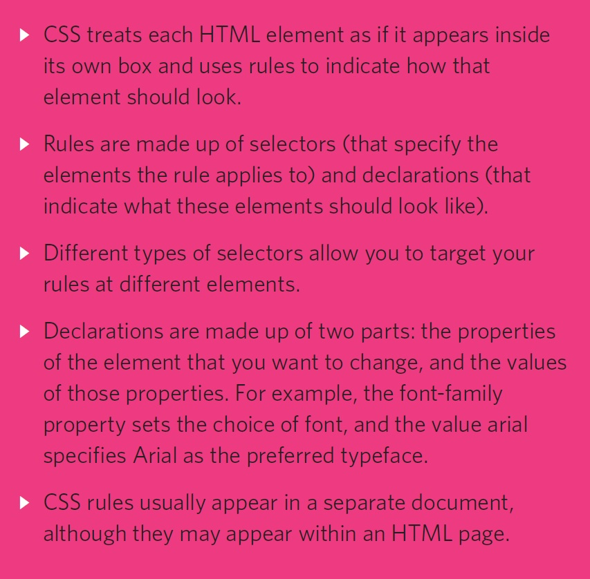
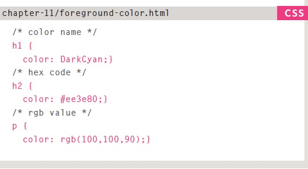
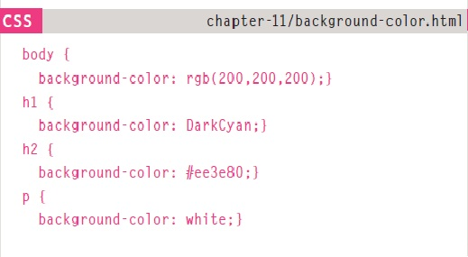
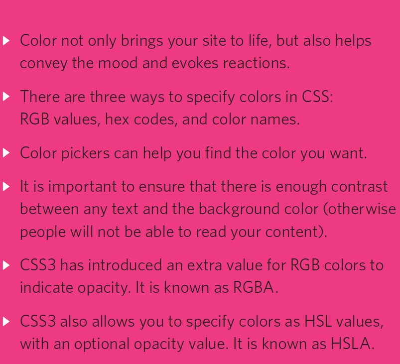
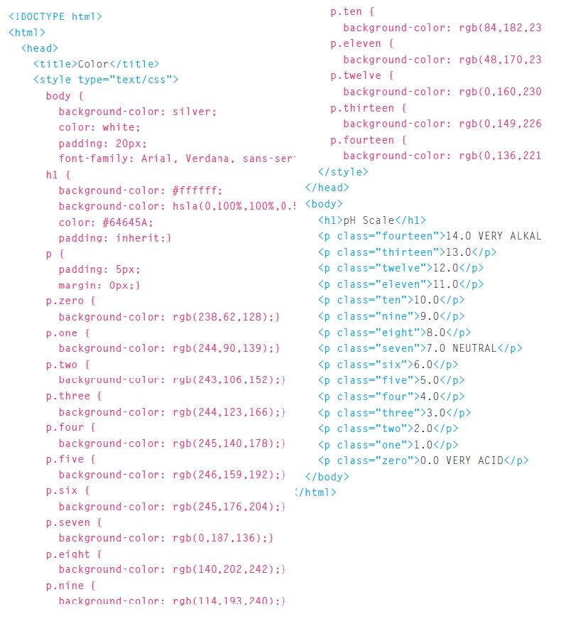

> * # Structural markup: the elements that you can use todescribe both headings and paragraphs
_________

> * # Semantic markup: which provides extra information; suchas where emphasis is placed in a sentence, that somethingyou have written is a quotation (and who said it), themeaning of acronyms, and so on
__________________________

_________________________________________________

