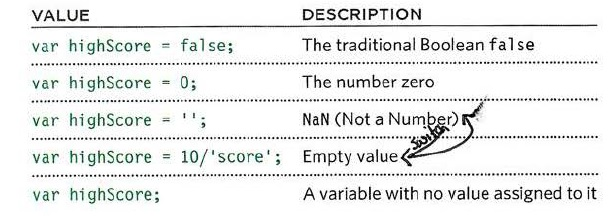
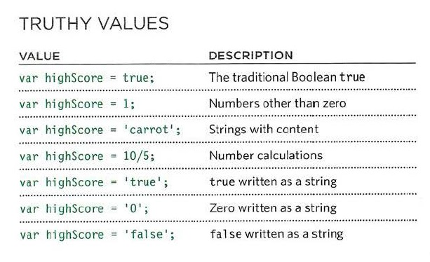
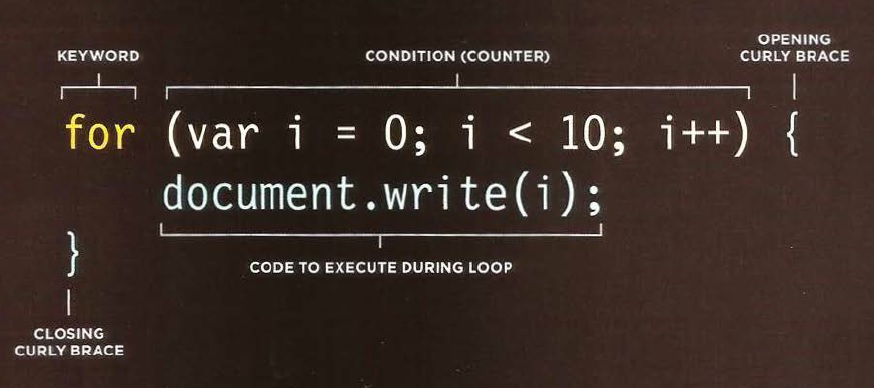
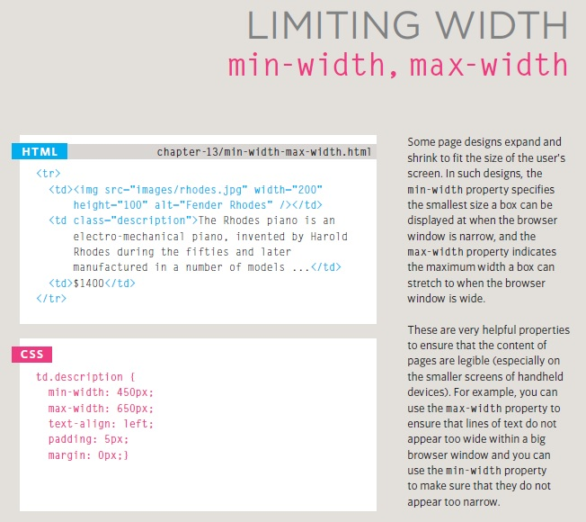
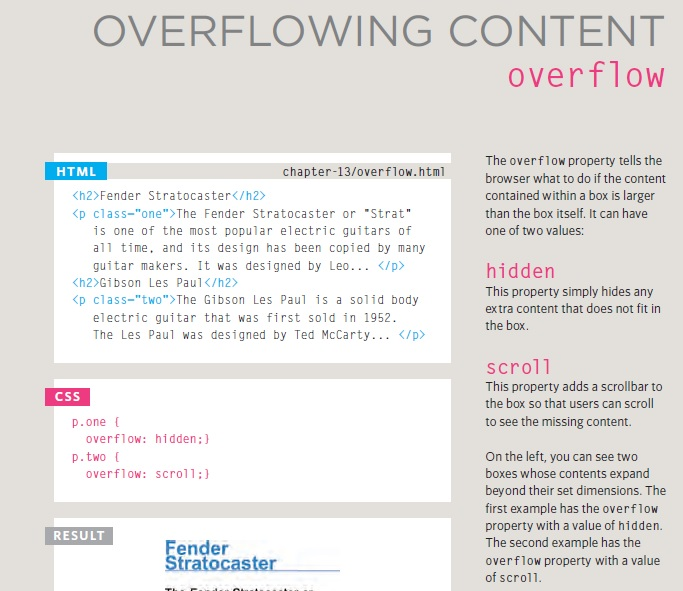

# what is Falsy values are ? treated as if they
# are fa 1 se. The table to the left
# shows a hi ghScore variable with
# a series of va lues, all of which
# are falsy.

_______________________________________________________________________

# what is Truthy values are ? treated as if
# they are true. Almost everything
# that is not in the falsy table can
# be treated as if it were true.
_____________________________________________________________________________________

