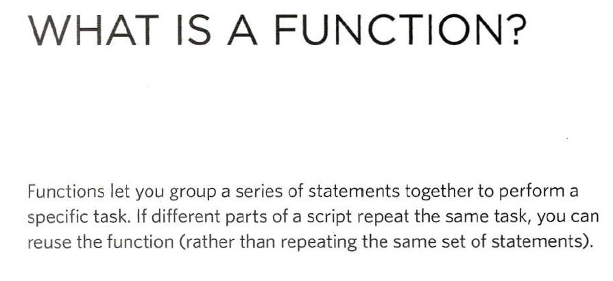
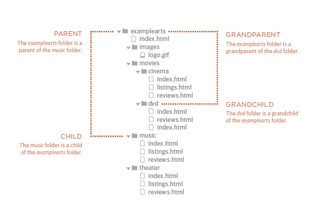
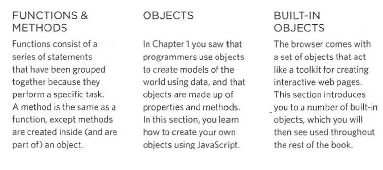

# 6 Reasons for Pair Programming

## 1. Greater efficiency

## 2. Engaged collaboration

## 3. Learning from fellow students

## 4. Social skills

## 5. Job interview readiness

## 6. Work environment readiness

_______________________________________________________________________________
_________________________________________________________________________________

