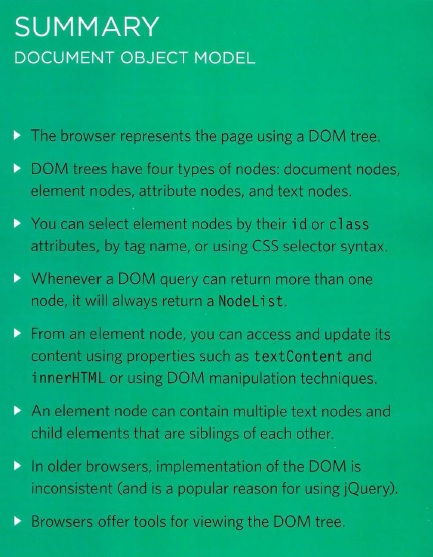

# Understanding The Problem Domain Is The Hardest Part Of Programming

## What is the hardest thing about writing code?

## There are many common answers to this question:

### 1- Learning a new technology
### 2- Naming things
### 3- Testing your code
### 4- Debugging
### 5- Fixing bugs
### 6- Making software maintainable
___________________________________________________________________________

# What can you do about it?
### If understanding the problem domain is the hardest part of programming and you want to make programming easier, you can do one of two things:

### 1- Make the problem domain easier
### 2- Get better at understanding the problem domain
### 3- You can often make the problem domain easier by cutting out cases and narrowing ### 4- your focus to a particular part of the problem.

__________________________________________________________________
_________________________________________________________________________________________

