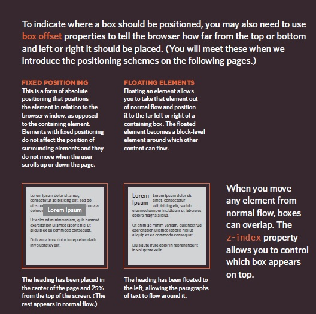

# css Layout

# Controlling the position of elements
# Creating site layouts
# Designing for different sized screens

## Normal Flow
## position:static
## Relative Positioning
## position:absolute
## position:fixed

### The liquid layout uses
### percentages to specify the width
### of each box so that the design
### will stretch to fit the size of thescreen.
### When trying this in your
### browser, remember to make the
### window smaller and larger
_______________________________________________________________________
________________________________________________________________________

