# INSERTING ELEMENTS

## jQuery allows you to recreate the functionalityof a loop on a selection of elements, using the • each () method.

_________________________________________________________________________________
_________________________________________________________________________________
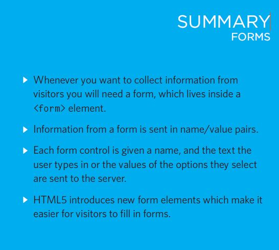

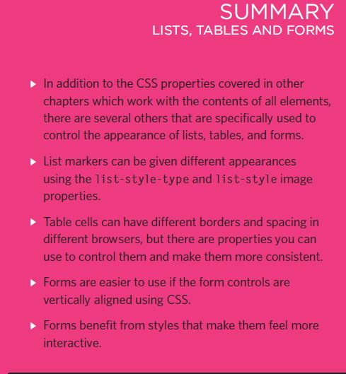

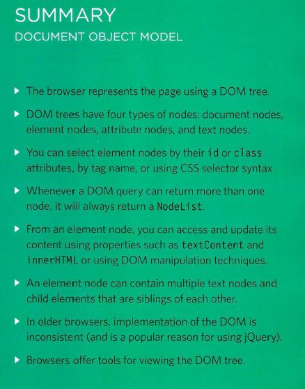

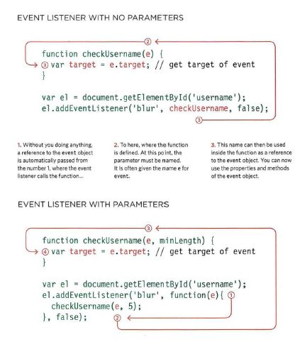

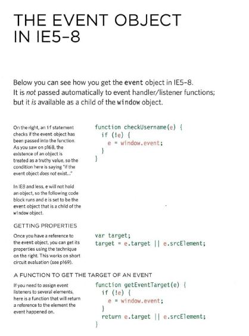

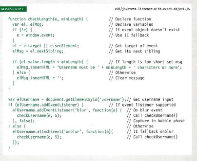

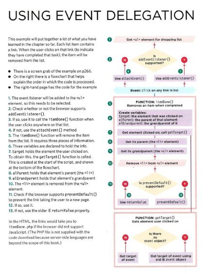

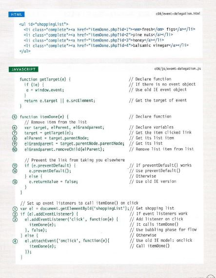

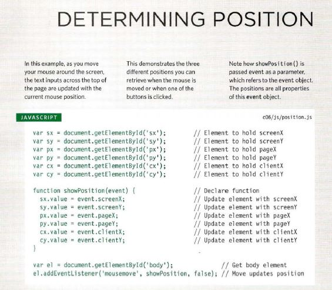

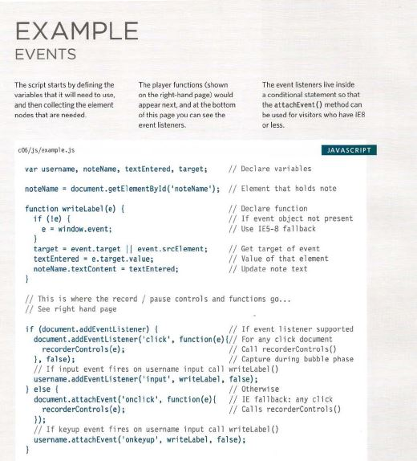

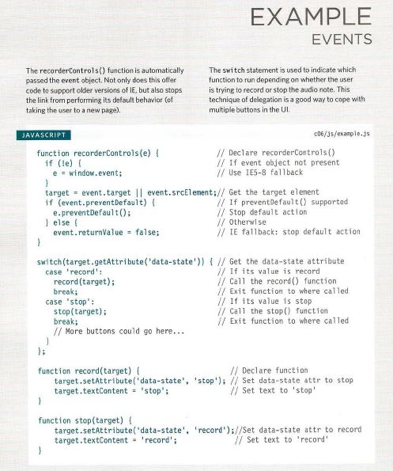

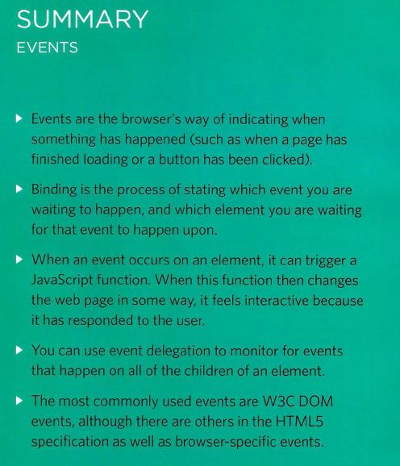
