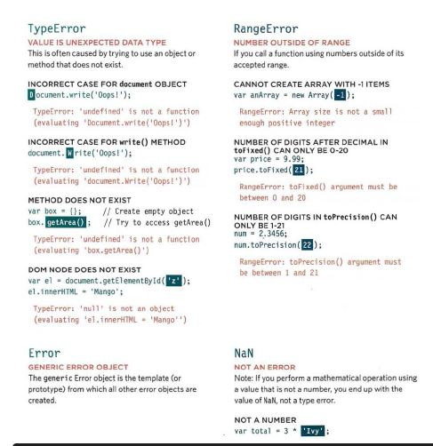
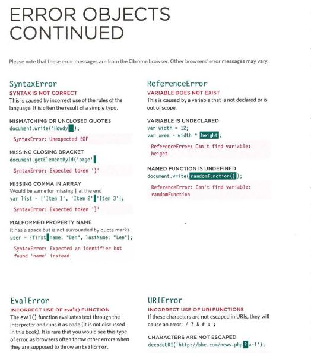
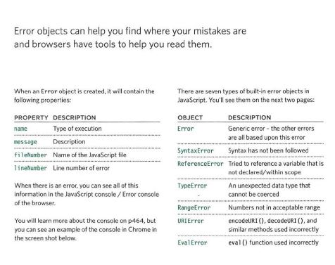
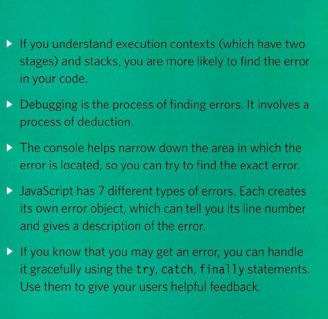

# EXECUTION CONTEXT & HOISTING

## 1: PREPARE
## • The new scope is created
## • Variables, functions, and arguments are created
## • The value of the this keyword is determined

## 2: EXECUTE
## • Now it can assign values to variables
## • Reference functions and run their code
## • Execute statements

_______________________________________________________________
______________________________________________________________

