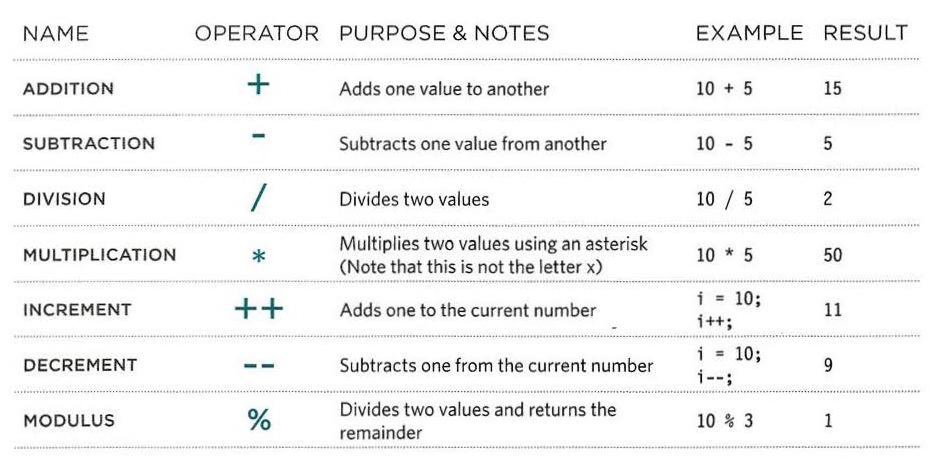
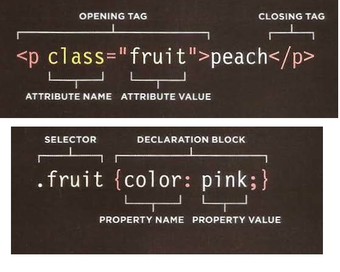

# A SCRIPT IS A SERI ES OF INSTRUCTIONS

#  DEFINE THE GOAL First, you need to define the task you want to
## achieve. You can think of this as a puzzle for the
## computer to solve.

# DESIGN THE SCRIPT
## To design a script you split the goal out into a series
## of tasks that are going to be involved in solving this
## puzzle. This can be represented using a flowchart.
## You can then write down individual steps that the
## computer needs to perform in order to complete
## each individual task (and any information it needs to
## perform the task), rather like writing a recipe that it
## can follow.

# CODE EACH STEP
## Each of the steps needs to be written in a
## programming language that the compu ter
## understands. In our case, this is JavaScript.

* ............................

* ...........................

+ var color = 'beige';

+ var area = 3 * 2;

+ color = 'beige';

* ............................

# ARITHMETIC OPERATORS

* ............................... 

# add by MOHAMMAD ADNAN ALAZZAM 

* ...............................

