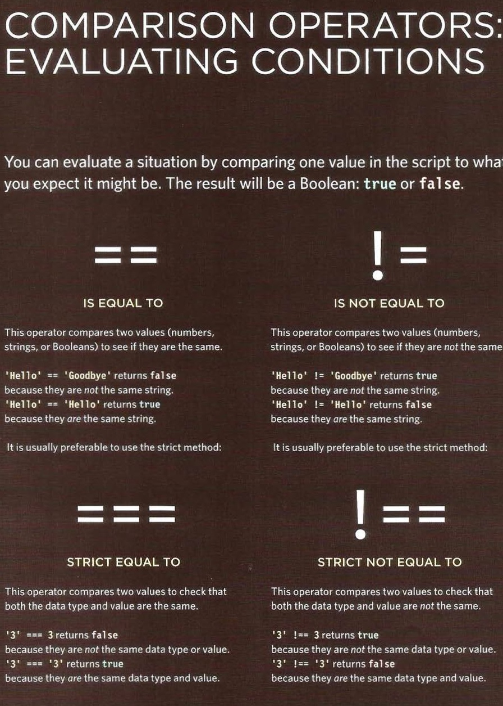
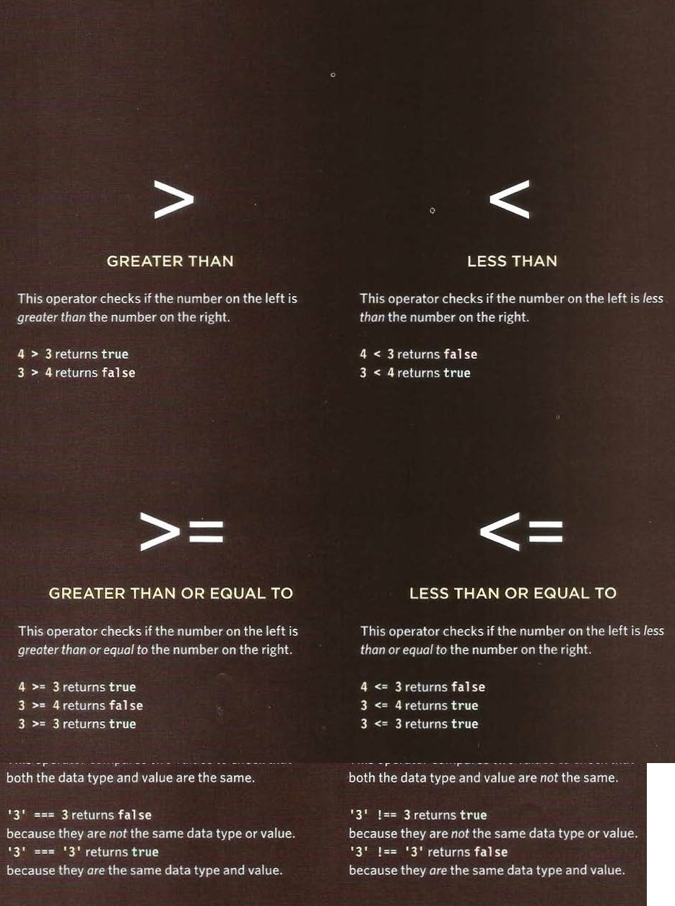
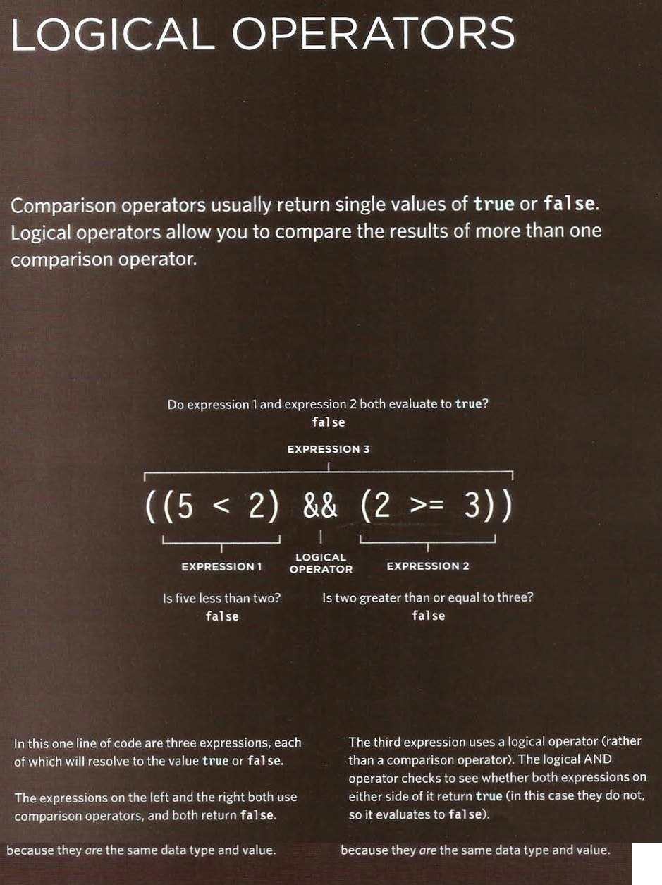
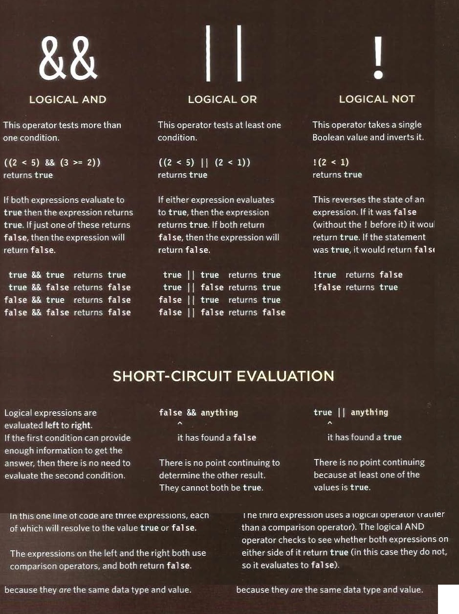
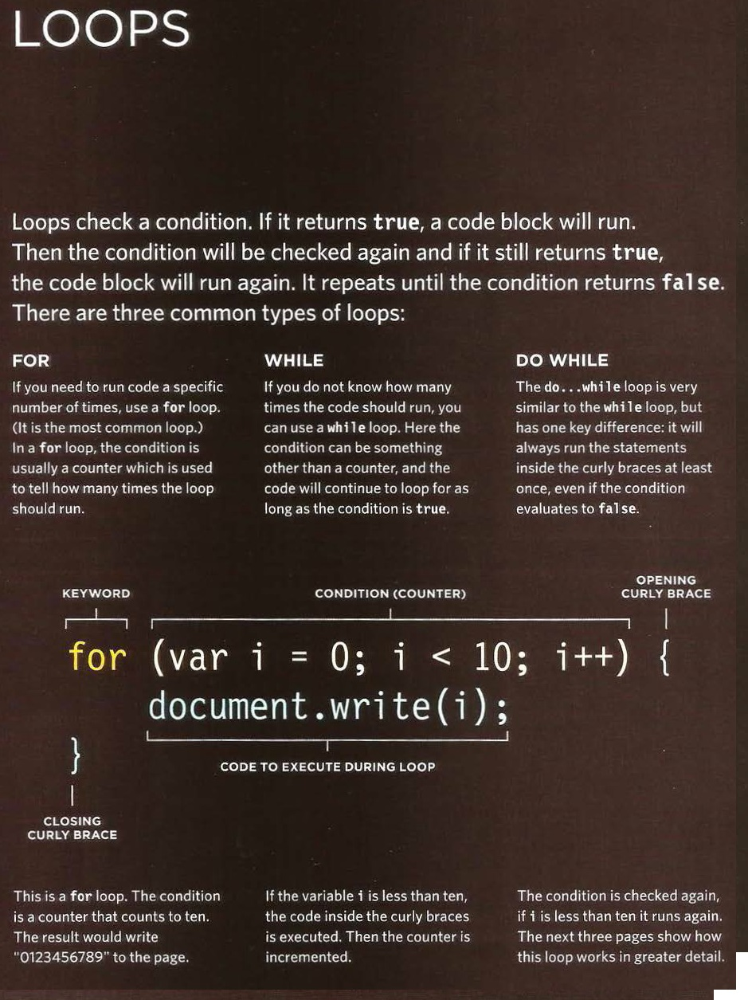
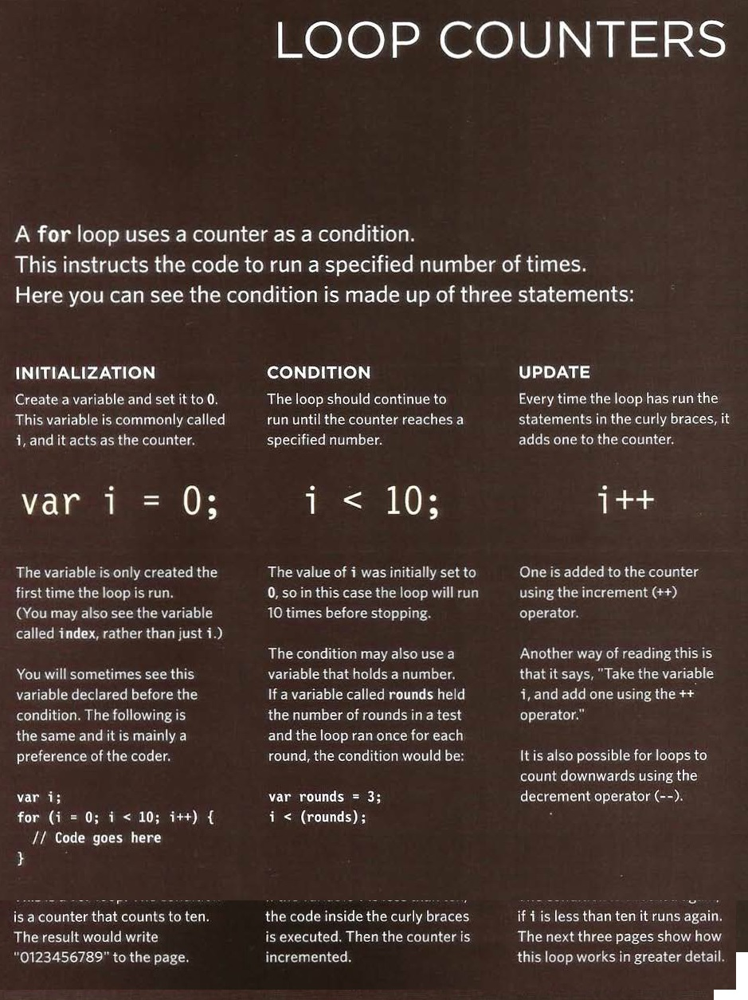

# USING WHILE LOOPS

+ var i = l ;
+ var msg = ' ' ;
+ II Set counter to 
+ II Message
+ II Store 5 times tabl e in a variable
+ while (i < 10) {
+ msg += i + ' x 5 = ' + (i * 5) + ' ';
+ i++;
+ document .getEl ementByid( ' answer') . innerHTML = msg;

+ ..............................................................

# USING FOR LOOPS

+ var scores= [24. 32, 17]; //Array of scores
+ var arraylength scores .l ength;// Items in array
+ var roundNumber = O; //Current round
+ var msg ''; //Message
+ var i ; // Counter
+ //Loop through the items in the array
+ for (i = O; i < arraylength; i++) {
+ //Arrays are zero based (so 0 is round 1)
+ //Add 1 to the current round
+ roundNumber = (i + l);
+ // Write the current round to message
+ msg += 'Round ' + roundNumber + ' : ';
+ //Get the score from the scores array
+ msg += scores[i] + ' ' ;
+ document .getElementByid( ' answer') .i nnerHTML msg;

+ ..............................................................

+ ..................................................................

# add by : MOHAMMAD ADNAN ALAZZAM 